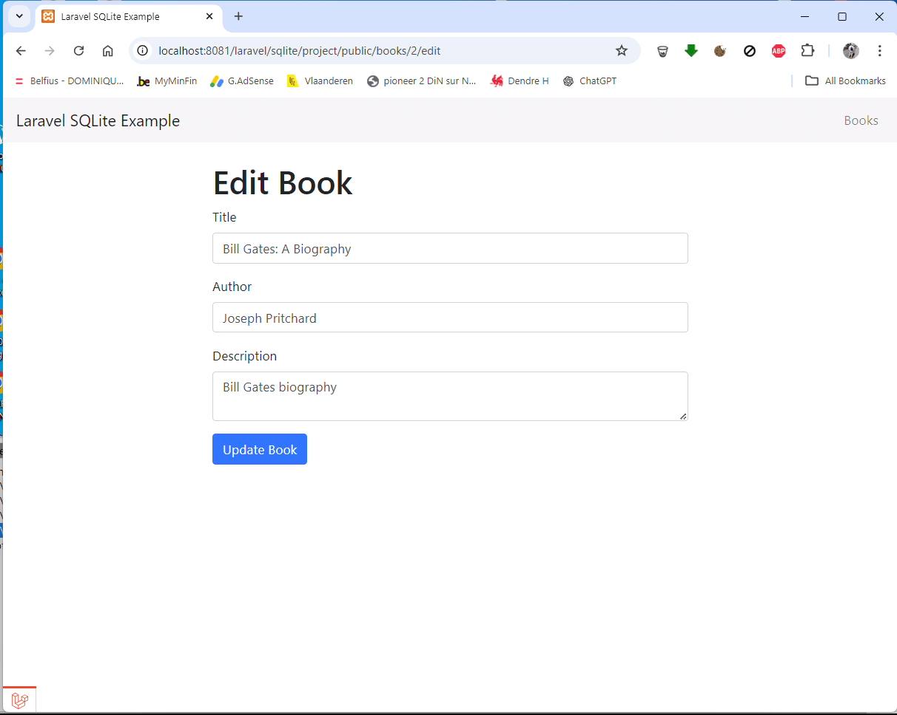

<h1 align="center">Laravel 10 SQLite example</h1>

    

This is a small CRUD example showing how to use SQLite database with Laravel 10

## Installation 
Make sure that you have setup the environment properly. You will need minimum PHP 8.1, SQLite, and composer.

1. Download the project (or clone using GIT)
2. Copy `.env.example` into `.env` 
3. Edit `.env`, change `APP_URL` and `DB_DATABASE` to match your requirements
4. Go to the project's root directory using terminal window/command prompt
5. Run `composer install`
6. Set the application key by running `php artisan key:generate --ansi`
7. Run `php artisan migrate –seed` (__optional__, a db file is already provided with some demo data)
8. Run migrations `php artisan migrate` (__not required__, there is no migration provided)
9. Start local server by executing `php artisan serve`
10. Run (__example url__) http://localhost:8081/laravel/sqlite/test/public/books to test the application

